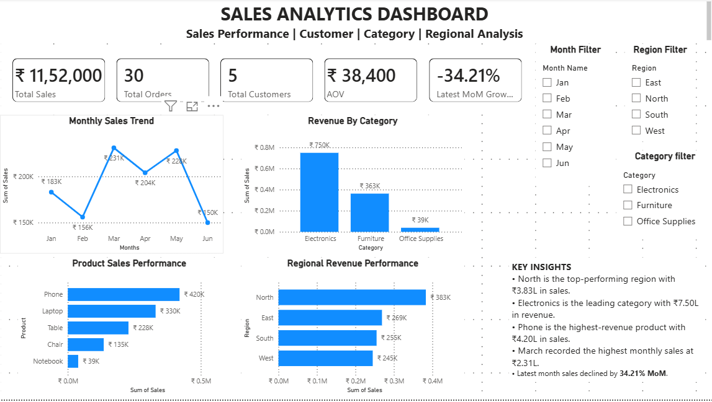
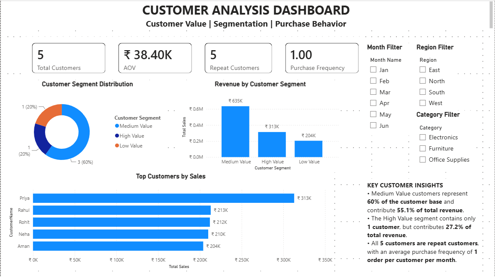

# 📊 Sales Analytics Dashboard

## 📌 Project Overview

This project analyzes a company's sales performance across different time periods, regions, categories, products, and customers.

The objective is to identify high-performing areas, understand customer purchasing behavior, track sales growth, and identify areas that require further investigation and improvement.

---

## 🎯 Project Objectives

- Analyze overall sales performance.
- Identify high-performing regions, categories, and products.
- Analyze monthly sales trends and MoM growth.
- Understand customer purchasing behavior.
- Segment customers based on their sales contribution.
- Identify top-performing customers.
- Identify areas where business performance requires further investigation.

---

## 🛠️ Tools & Technologies

| Tool | Purpose |
|---|---|
| SQL | Data analysis and business calculations |
| Power BI | Interactive dashboard and visualization |
| DAX | Dynamic measures and calculations |

---

# 🔍 SQL Analysis

The sales data was analyzed using SQL through multiple analytical queries.

### Sales Overview

- Total Sales
- Total Orders
- Total Customers
- Average Order Value
- Monthly Sales Trend
- Regional Performance

### Product & Category Analysis

- Product-wise Sales
- Category-wise Revenue
- Product Revenue Contribution
- Category Revenue Contribution
- Top Product by Category

### Customer Analysis

- Customer Sales
- Customer AOV
- Purchase Frequency
- Monthly Customer Spending
- Customer Ranking
- Repeat Purchase Analysis
- Repeat Revenue Analysis
- Customer Loyalty Ranking

### Customer Segmentation

Customers were classified based on their total sales:

| Segment | Sales Threshold |
|---|---:|
| High Value | > ₹3,00,000 |
| Medium Value | ₹2,10,000 – ₹3,00,000 |
| Low Value | < ₹2,10,000 |

### Advanced SQL Concepts

The project demonstrates:

- `GROUP BY`
- `WHERE`
- `HAVING`
- `JOIN`
- CTEs
- `CASE WHEN`
- `COUNT(DISTINCT)`
- `RANK()`
- `DENSE_RANK()`
- `LAG()`
- `PARTITION BY`
- Window Functions
- Aggregation
- Percentage Calculations

---

# 📈 Power BI Dashboard

The dashboard contains two analytical pages.

## Page 1 — Sales Analytics

The first page focuses on overall sales performance.

### KPIs

- Total Sales
- Total Orders
- Total Customers
- Average Order Value
- Latest MoM Growth

### Analysis

- Monthly Sales Trend
- Revenue by Region
- Revenue by Category
- Product Performance
- MoM Growth

### Dashboard Preview

---

## Page 2 — Customer Analysis

The second page focuses on customer value and purchasing behavior.

### KPIs

- Total Customers
- AOV
- Repeat Customers
- Purchase Frequency

### Analysis

- Customer Segment Distribution
- Revenue by Customer Segment
- Top Customers by Sales
- Key Customer Insights

### Dashboard Preview

---

# 🧮 DAX & Data Model

A separate Date Table was created to support month-wise analysis and time-based calculations.

The Date Table has a one-to-many relationship with the Orders table.

DAX was used to create dynamic measures such as:

- Total Sales
- Total Orders
- Total Customers
- AOV
- MoM Growth
- Latest MoM Growth
- Repeat Customers
- Purchase Frequency
- Customer Segmentation

The measures respond dynamically to filters such as Date, Region, and Category.

---

# 💡 Key Business Insights

### 1. Regional Performance

North was the leading region with **₹3.83L** in sales.

### 2. Category Performance

Electronics generated **₹7.50L**, contributing approximately **65.1%** of total revenue.

### 3. Product Performance

Phone was the highest-revenue product with **₹4.20L** in sales.

### 4. Monthly Performance

March recorded the highest monthly sales at **₹2.31L**.

### 5. Latest Sales Trend

June showed a **34.21% MoM decline** compared with May.

### 6. Customer Performance

Priya was the highest-value customer with **₹3.13L** in sales.

### 7. Customer Segmentation

Medium Value customers represented **60% of the customer base** and contributed approximately **55.1% of total revenue**.

### 8. Repeat Customers

All **5 customers** in the dataset were repeat customers.

---

# 💼 Business Recommendations

- Retain High Value customers through good customer experience and loyalty benefits.
- Encourage Medium Value customers to increase their purchases and potentially move toward the High Value segment.
- Improve purchase frequency and order value among Low Value customers.
- Maintain the strong performance of Electronics and Phone and explore related-product opportunities.
- Investigate the reason behind the June sales decline by checking region, category, and product performance.

---

# 📂 Project Files

- [SQL Analysis](Sales_Analytics_Project.sql)
- [Power BI Dashboard](Sales_Analytics_Dashboard.pbix)
- [Sales Analytics Screenshot](sales-dashboard.png)
- [Customer Analysis Screenshot](customer-dashboard.png)

---

# 🏁 Conclusion

This project combines SQL analysis, DAX calculations, and Power BI visualization to transform sales data into an interactive business dashboard.

The analysis provides insights into sales performance, regional and product contribution, customer value, purchasing behavior, and monthly growth while highlighting areas that require further investigation.

---

## 👨‍💻 Skills Demonstrated

**SQL | Power BI | DAX | Data Analysis | Data Visualization | Business Analysis**
